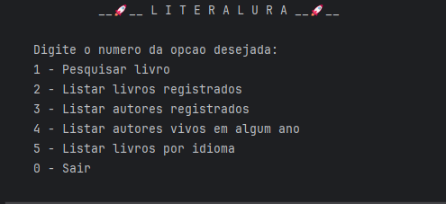

<div align="center">
  <h1>
    📖 L I T E R A T U R A 📖
  </h1>
  <p>
    Challenge - Oracle ONE
  </p>
</div>

<div align="center">

</div>

## 🕵️ Descrição
O desafio proposto é criar uma aplicação com Spring Boot que realize pesquisas por livros com a api gutendex.com e faça operações de persistência e exibição de dados.

## 🛠️ Uso
Use git clone e execute o projeto, será necessário também gerar o próprio servidor postgres e configurar adequadamente em application.properties.
```bash
git clone https://github.com/CaioMtho/Challenge-Literalura
```
> Depende do Java 21

## 🧰 Funcionalidades
- Pesquisar livros disponíveis no Gutendex;
- Persistir dados de livros e autores pesquisados;
- Apresentar os dados persistidos ao usuário;
- Filtrar autores vivos em determinado ano e livros com uma linguagem específica.

## 📷 Prints


> Outros prints em "screenshots-literalura"
## 🤖 Tecnologias


